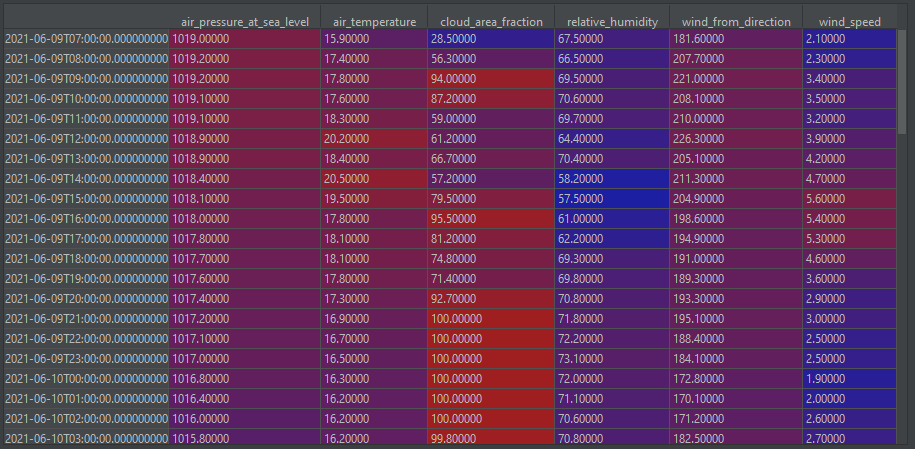

# Get data from met.no API
The assignment is to get a simple weather forecast using the met.no API. The API documentation can be found [here](https://api.met.no/weatherapi/locationforecast/2.0/documentation). 

A function called `get_met` should be implemented, taking `latitude` and `longitude` of a location as arguments. An example structure is found in `get_met.py`. Tests of the function can be found in `test_met.py`. The `get_met` function should query the `compact` endpoint of the met.no API and structure the results of the data labeled as `instant` in a datetime indexed Pandas DataFrame. Timestamps should be parsed into datetime objects. An example of what the DataFrame should look like is shown here:

## Hints
met.no enforces a minimum level of "authentication". To access the API, any client must identify itself using a `"User-Agent"` field in the request header, e.g. `"User-Agent": "your_name email@example.com"`. Any requests without this will result in a  `403 Forbidden` error.

## Submission
Please do not send python files as attachment in an email, as they tend to get stopped by antivirus. Instead, publish the result in a github gist or repo or similar.
